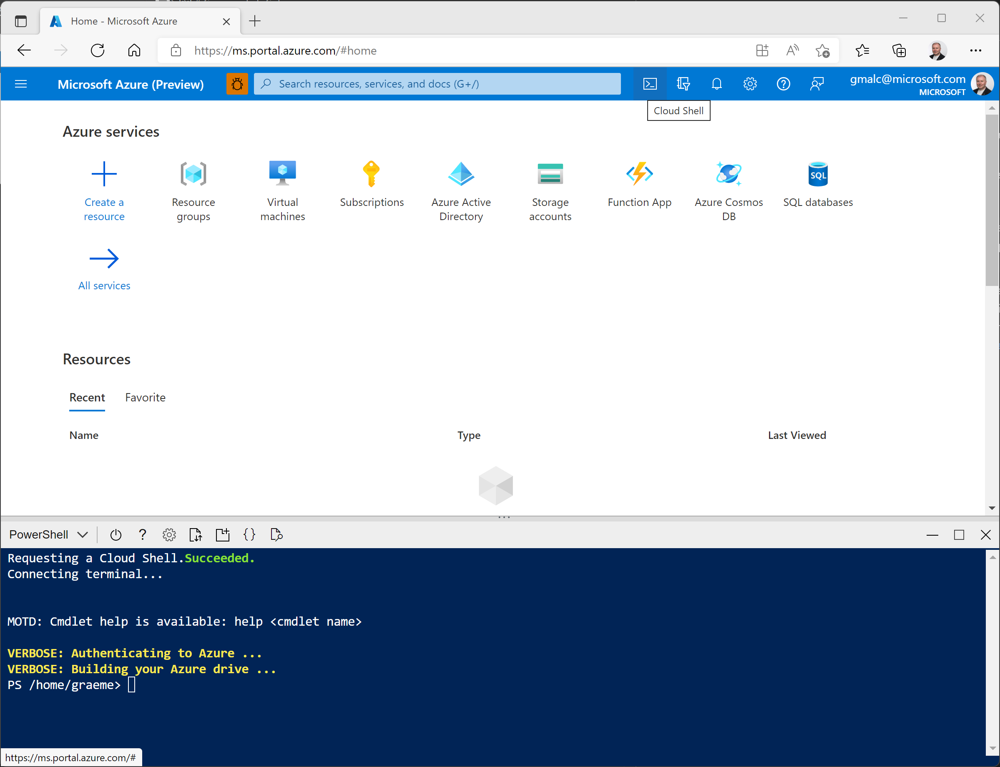

# Synapse Lab Setup

You'll need an [Azure subscription](https://azure.microsoft.com/free)!

1. Sign into the [Azure portal](https://portal.azure.com).
2. Use the **[\>_]** button to the right of the search bar at the top of the page to create a new Cloud Shell in the Azure portal, selecting a ***PowerShell*** environment and creating storage if prompted. The cloud shell provides a command line interface in a pane at the bottom of the Azure portal, as shown here:

    

    > **Note**: If you have previously created a cloud shell that uses a *Bash* environment, use the the drop-down menu at the top left of the cloud shell pane to change it to ***PowerShell***.

3. Note that you can resize the cloud shell by dragging the separator bar at the top of the pane, or by using the **&#8212;**, **&#9723;**, and **X** icons at the top right of the pane to minimize, maximize, and close the pane. For more information about using the Azure Cloud Shell, see the [Azure Cloud Shell documentation](https://docs.microsoft.com/azure/cloud-shell/overview).

4. In the PowerShell pane, enter the following command to clone this repo:

    ```
    git clone https://github.com/GraemeMalcolm/synapsestuff dp-500
    ```

5. After the repo has been cloned, enter the following commands to change to the **setup** folder and run the **setup.ps1** script it contains:

    ```
    cd dp-500/setup
    ./setup.ps1
    ```

6. When prompted, enter a suitable password to be set for your Azure Synapse SQl pool.

    > **Note**: Be sure to remember this password!

7. Wait for the script to complete - this typically takes around 20 minutes; but in some cases may take longer.
8. After creating the Synapse workspace and SQL Pool and loading the data, the script pauses the pool to prevent unnecessary Azure charges. When you're ready to work with your data in Azure Synapse Analytics, you'll need to resume the **sqldw** SQL Pool.
